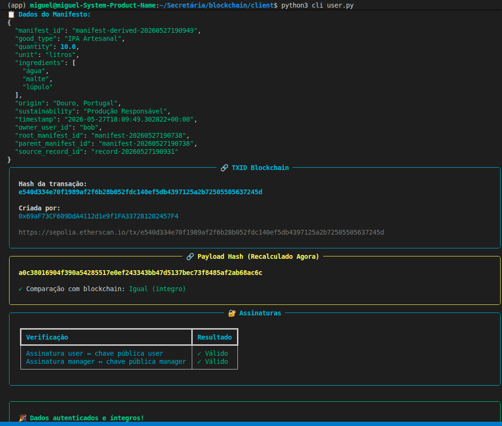
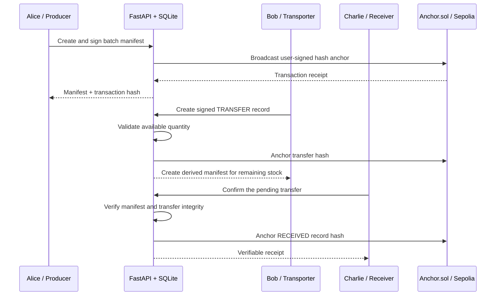
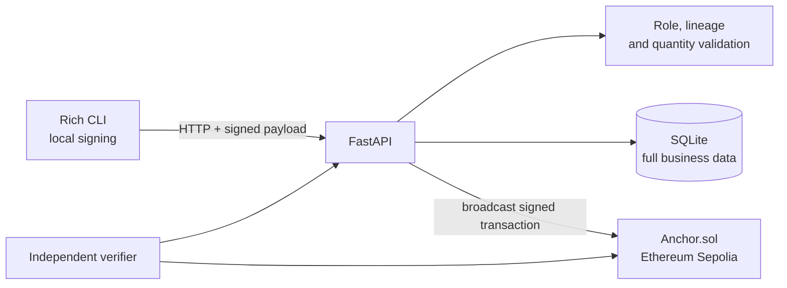

# Blockchain-Backed Supply Chain Traceability

> A hybrid traceability system for craft beer that combines an off-chain operational database with tamper-evident proofs anchored on Ethereum Sepolia.

[](https://www.python.org/)
[](https://fastapi.tiangolo.com/)
[](https://soliditylang.org/)
[](https://sepolia.etherscan.io/)
[](https://www.sqlite.org/)

## Demo preview



<p align="center">
  <em>The CLI independently verifies the off-chain payload against its blockchain anchor and digital signatures.</em>
</p>

## The problem

Supply chains often rely on data stored by one central operator. If that database is changed—accidentally or maliciously—other participants may have no independent way to prove what the original record contained.

Storing every business field directly on a public blockchain would provide transparency, but it is expensive, slow, and unsuitable for operational or sensitive data.

This project explores a practical middle ground:

- complete manifests and operational records stay in SQLite;
- every payload is converted into deterministic canonical JSON and hashed with SHA-256;
- the user and the Supply Chain Manager sign the same hash;
- only the hash, timestamp, creator, and item ID are anchored on Ethereum Sepolia;
- any later modification becomes detectable by recomputing and comparing the evidence.

The result is an auditable trail that does not require an independent verifier to blindly trust the API or its database.

## Demo scenario

The application models a craft beer journey across three participants:

| Participant | Role | Responsibility |
| --- | --- | --- |
| Alice | Producer | Creates the original batch manifest |
| Bob | Transporter | Records a transfer and receives a derived manifest for the remaining quantity |
| Charlie | Receiver | Confirms receipt against Bob's exact transfer |
| Supply Chain Manager | Co-signer | Co-signs operations without replacing the participant's signature |



## What makes it interesting

- **Hybrid architecture:** operational data remains off-chain while immutable integrity proofs live on-chain.
- **Local key custody:** private keys are entered and used by the CLI; they are never sent to the backend.
- **Dual signatures:** both the participant and the Supply Chain Manager sign the canonical payload hash.
- **Role-based workflow:** producers, transporters, and receivers can only create records allowed for their role.
- **Quantity consistency:** transfers cannot exceed available stock, and receipts cannot exceed the referenced transfer.
- **Manifest lineage:** transfer-derived manifests preserve root, parent, and source-record references.
- **Independent verification:** the verifier checks the current payload, stored hash, signatures, transaction sender, contract call, and item ID.
- **Tamper demonstration:** built-in test endpoints can alter an off-chain quantity to demonstrate that verification then fails.

## Architecture



| Layer | Technology | Purpose |
| --- | --- | --- |
| Client | Python, Rich, eth-account | Interactive workflow, wallet validation, local signatures |
| API | FastAPI, Pydantic | Endpoints, validation, orchestration, verification |
| Repository | SQLAlchemy, SQLite | Off-chain manifests, records, hashes, signatures, and transaction references |
| Shared cryptography | SHA-256, ECDSA | Canonical hashing, signing, and signature verification |
| Blockchain | Solidity, Web3.py, Sepolia | Immutable hash anchoring and transaction evidence |

## Integrity verification

For each manifest or record, the system:

1. rebuilds the canonical payload;
2. recomputes its SHA-256 hash;
3. compares it with the hash stored in the repository;
4. verifies the participant's ECDSA signature;
5. verifies the manager's signature and expected Ethereum address;
6. fetches and decodes the Sepolia transaction;
7. confirms that it called `anchorHash` on the expected contract;
8. compares the on-chain hash and item ID with the current resource.

The resource is considered valid only when every required check succeeds.

## Smart contract

[`Anchor.sol`](app/contracts/Anchor.sol) deliberately has a narrow responsibility. It stores a unique payload hash together with its timestamp, creator, and business item ID:

```solidity
function anchorHash(
    bytes32 payloadHash,
    uint256 timestamp,
    string calldata itemId
) external;
```

Keeping the contract small reduces on-chain cost and leaves business rules in the application layer, where they can evolve more easily.

## Project structure

```text
.
├── app/
│   ├── contracts/       # Solidity anchor contract
│   ├── core/            # Settings, database, and security
│   ├── models/          # SQLAlchemy models
│   ├── routers/         # FastAPI endpoints
│   ├── schemas/         # Pydantic request/response models
│   ├── services/        # Business, blockchain, and verification logic
│   └── main.py          # API entry point
├── client/
│   ├── cli_user.py      # Interactive Alice/Bob/Charlie demo
│   ├── api_client.py    # HTTP client
│   └── blockchain_client.py
└── shared/              # Canonical hashing, signatures, and transaction signing
```

## Getting started

### Prerequisites

- Python 3.14+
- [`uv`](https://docs.astral.sh/uv/)
- a Sepolia RPC URL
- four development wallets: Alice, Bob, Charlie, and the Supply Chain Manager
- Sepolia ETH for contract deployment and anchor transactions

> Use test wallets only. Never commit private keys or real funds to this repository.

### 1. Install dependencies

From the repository root:

```bash
uv sync --project app
uv sync --project client
```

### 2. Configure the backend

Create `app/.env`:

```env
SEPOLIA_RPC_URL=https://your-sepolia-rpc.example
SUPPLY_MANAGER_ADDRESS=0xYourManagerPublicAddress
BOB_ADDRESS=0xBobsPublicAddress
```

`MANAGER_KEY` is optional and is not required by the normal CLI flow. Private keys should remain on the client side.

### 3. Configure the client

Create `client/.env`:

```env
ALICE_ADDRESS=0xAlicesPublicAddress
BOB_ADDRESS=0xBobsPublicAddress
CHARLIE_ADDRESS=0xCharliesPublicAddress
SUPPLY_MANAGER_ADDRESS=0xYourManagerPublicAddress

# Optional: the CLI writes this after deploying a contract
CONTRACT_ADDRESS=0xYourExistingAnchorContract
```

### 4. Start the API

```bash
uv run --project app fastapi dev app/main.py
```

Useful local URLs:

- API documentation: <http://127.0.0.1:8000/docs>
- Health check: <http://127.0.0.1:8000/health>

### 5. Start the interactive demo

In a second terminal:

```bash
uv run --project client python client/cli_user.py
```

The CLI validates each private key against the configured public address. If no valid contract is configured, it can prepare, locally sign, and deploy a new `Anchor` contract to Sepolia.

## Suggested presentation flow

For a short recruiter or technical interview demo:

1. show the API documentation and the small `Anchor.sol` contract;
2. log in as Alice and create a craft beer manifest;
3. switch to Bob and transfer part of the batch;
4. show the derived manifest and remaining quantity;
5. switch to Charlie and confirm the pending transfer;
6. verify a resource and open its transaction on Sepolia Etherscan;
7. run the tamper simulation and verify the same resource again;
8. highlight that the database changed, but the signatures and blockchain evidence did not.

## API highlights

| Method | Endpoint | Description |
| --- | --- | --- |
| `POST` | `/manifests` | Validate, anchor, and store a signed manifest |
| `GET` | `/manifests/{id}` | Retrieve a manifest with integrated verification |
| `GET` | `/manifests/{id}/chain` | Inspect lineage and available quantity |
| `POST` | `/records` | Create a role-controlled operational record |
| `GET` | `/records/pending-transfers` | List transfers awaiting receipt |
| `GET` | `/records/{id}` | Retrieve a record with integrated verification |
| `POST` | `/verify` | Run the complete independent verification pipeline |
| `POST` | `/config/validate-contract` | Validate an existing Sepolia contract |

## Design decisions and scope

This is a portfolio and learning project, not a production supply-chain platform. It intentionally focuses on integrity, provenance, signing, blockchain anchoring, and cross-participant workflow.

Before production use, the system would need stronger identity and authorization management, secret storage or hardware wallets, migrations, automated tests, observability, transaction retry/idempotency controls, a production database, and an external security review.

## Skills demonstrated

Python backend development, REST API design, domain modelling, asymmetric cryptography, smart contracts, Web3 integration, transaction decoding, relational persistence, security-oriented architecture, and interactive CLI design.
